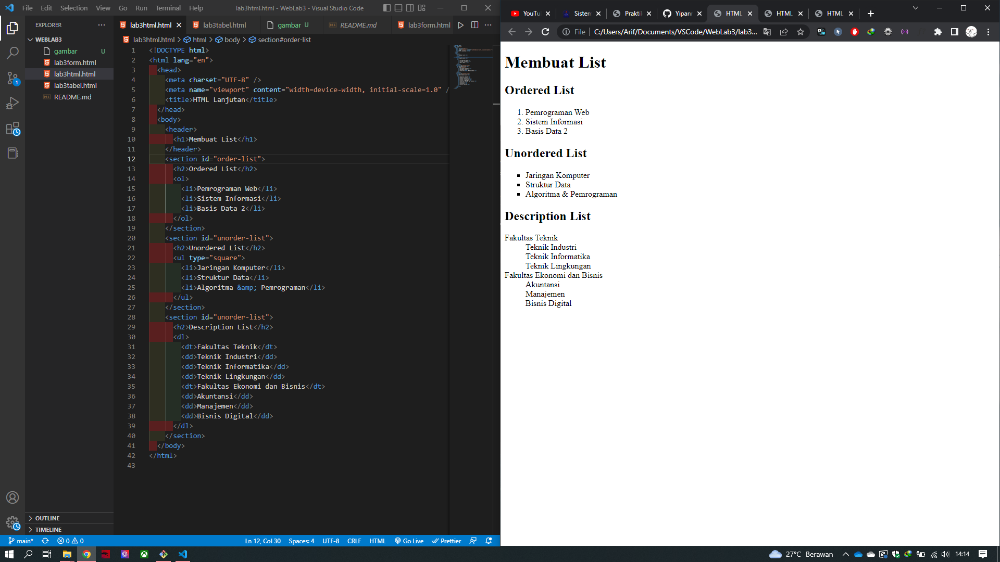
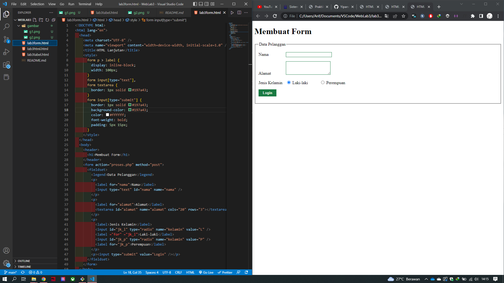

# Weblab3

### Pembuatan List Pada HTML
Pada Pembuatan List ada 3 macam pembuatan list pada HTML
contohnya sepperti gambar dibawah

Ordered List yang tampil otomatis membuat list nomor pada isian kode
Unordered List yang tampil dengan titik kotak pada isian kode
Description List yang tampil berupa susunan isian yang lebih rapih untuk list denga kategori tertentu

### Pembuatan Tabel Pada HTML
pembuatan tabel bagi yang sudah tidak asing lagi dengan penggunaan Ms.Excel pasti akan mudah memahaminya dengan adanya komponen tag `<tabel></tabel>` ini berguna untuk menginisiasikan sebuah tag agar menjadi sebuah tabel lalu untuk pembuatannya menggunakan `<td></td>` Table Down dan `<tr></tr>` Table Row. pada bagian tag `<table></table>` ada pengaturan lagi yang digunakan untuk kostumisasi pada table di HTML seperti contohnya
`<table border="1" cellpadding="6" cellspacing="0">` hasilnya seperti gambar di bawah

### Pembuatan Form Pada HTML
Pada pembuatan kolom form ini sangat berguna untuk pengisian website dinamis dimana data yag sudah di isi bisa tersimpan pada database yang bisa di lihat kembali ketika dibutuhkan.

pada tabel form terdapat `action="proses.php` yang dimana ini bertugas memferivikasi data yang akan ditambahkan pada database atau menyambungkan kode untuk perintah `POST` melalui `PHP` yang terkoneksi database

pada tag `input type="text"` ini akan menampilkan tipe masukan data yang dapat dilihat oleh pengguna

pada tag `input type="password"` ini akan menampilkan tipe masukan data yang dilihat oleh pengguna adalah `*******`

contoh hasil form input seperti gambar dibawah
